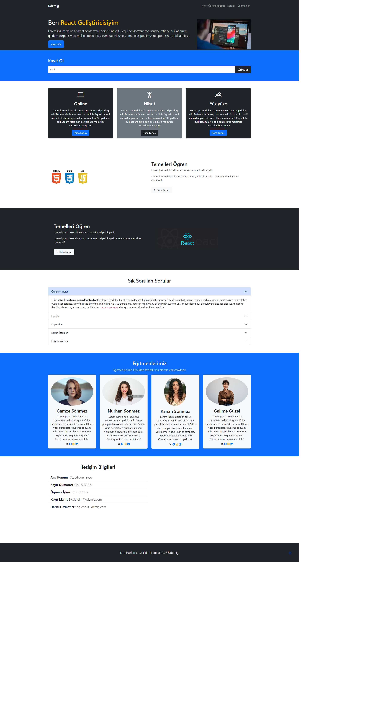

<!DOCTYPE html>
<html lang="tr">
<head>
<meta charset="UTF-8">

</head>

<body>

<h1 align="center">🚀 pro-udemig-bootstrap</h1>

Bootstrap kullanılarak geliştirilmiş modern ve responsive eğitim tanıtım web sitesi projesi.

<h2>📌 Proje Hakkında</h2>

Bu proje Bootstrap 5 kullanılarak oluşturulmuş modern bir landing page çalışmasıdır.
Navbar, modal, accordion, kart yapıları ve responsive grid sistemi kullanılmıştır.
Amaç: Bootstrap bileşenlerini gerçek bir proje üzerinde uygulamak.

<ul>
<li>Responsive tasarım</li>
<li>Modern UI bileşenleri</li>
<li>Modal form yapısı</li>
<li>Accordion (SSS bölümü)</li>
<li>Eğitmen kartları</li>
<li>Google Maps entegrasyonu</li>
</ul>

<h2>🛠 Kullanılan Teknolojiler</h2>

<ul>
<li>HTML5</li>
<li>CSS3</li>
<li>Bootstrap 5</li>
<li>Bootstrap Icons</li>
</ul>

<h2>📂 Proje Yapısı</h2>

<pre>
pro-udemig-bootstrap/
│
├── images/
│   ├── ios.jpeg
│   ├── based.png
│   ├── react.png
│   ├── person.jpeg
│   ├── person2.jpg
│   ├── person3.jpg
│   └── person4.jpg
├── index.html
├── style.css
├── README.md
├── pro-udemig-bootstrap.png
└── pro-udemig-bootstrap.gif
</pre>

<h2>✨ Özellikler</h2>

<ul>
<li>Fixed-top responsive navbar</li>
<li>Modal kayıt formu</li>
<li>Kart yapıları ile eğitim seçenekleri</li>
<li>Accordion ile sık sorulan sorular</li>
<li>Eğitmen tanıtım alanı</li>
<li>Harita ve iletişim bölümü</li>
<li>Mobil uyumlu tasarım</li>
</ul>

<<h2>📸 Proje Önizleme</h2>

<h2>⚙️ Canlı Demo</h2>

<h2>👨‍💻 Geliştirici</h2>

<strong>Kenan Sönmez</strong> 
Frontend Developer

p>
🔗 GitHub: 
<a href="https://github.com/kenansonmez1617-hub" target="_blank">
https://github.com/kullanici-adin
</a>

💼 LinkedIn: 
<a href="https://www.linkedin.com/in/kullanici-adin" target="_blank">
https://www.linkedin.com/in/kenan-sonmez
</a>

<h2>📄 Lisans</h2>

Bu proje eğitim amaçlı geliştirilmiştir.
Serbestçe kullanılabilir ve geliştirilebilir.

⭐ Eğer projeyi beğendiyseniz yıldız vermeyi unutmayın!

</body>
</html>
